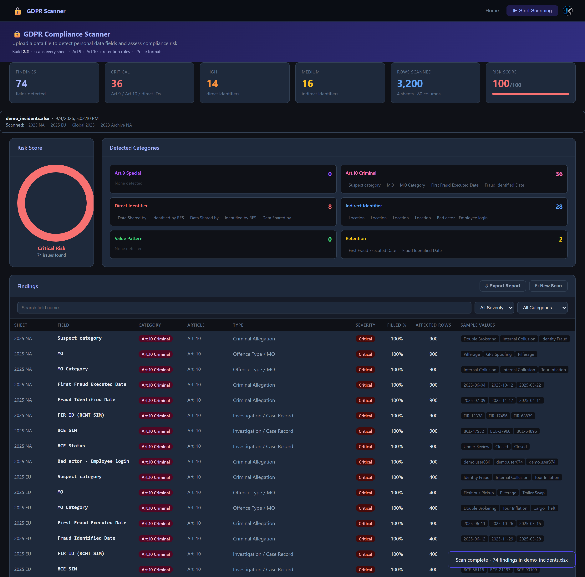
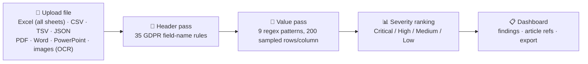

# GDPR Compliance Scanner

**Screen any data file for personal data before you share, upload, or archive it.**
No signup. No server. No data ever leaves your browser.

*A heuristic triage tool — a linter for personal data, not a compliance assessment.*

## Preview

    
    
  

<em>Results above are from a synthetic demo workbook, not real data.</em>

## The problem

Before a spreadsheet, export, or data dump gets shared, uploaded, or archived, someone has to ask: does this contain personal data GDPR cares about? Doing that by eye across hundreds of columns and thousands of rows is slow and easy to get wrong — a stray IBAN, DOB, or health note buried in row 4,000 is exactly what causes a real breach.

This tool scans the file itself, locally, and tells you in seconds which columns look like personal data, which GDPR article each one engages, and how much of the file is affected — so a human can make the actual call.

It is deliberately a **screening** tool. It answers *"what is in here that I should look at?"* — not *"are we compliant?"* See [Limitations](#limitations) for what it cannot conclude.

## How it works

## How to use it

1. **Open the app** — click Start Scanning on the [live site](https://jeevan-0508.github.io/gdpr-compliance-scanner/gdpr_scanner.html), or open the downloaded file directly. No account, no install required.
2. **Drag and drop a file** (or click Browse):
   - **Tabular** — `.csv` `.tsv` `.xlsx` `.xls` `.xlsm` `.ods` `.json`. Every sheet in a workbook is scanned, not just the first.
   - **Documents** — `.pdf` `.docx` `.pptx` `.odt` `.xml` `.html` `.txt` `.md` `.log`
   - **Images (OCR)** — `.png` `.jpg` `.webp` `.bmp` `.tiff`
3. **Let it scan** — the header pass checks every column name against 35 GDPR field rules, then the value pass regex-scans up to 200 sampled rows per column for 9 pattern types (emails, IBANs, cards, national IDs, GPS, DOB, passport numbers, IP addresses). Free-text formats are scanned with 9 unanchored equivalents plus the field-name terms.

   Findings are grouped into six categories: **Art. 9 Special** (health, biometric, genetic, racial/ethnic, religious, political, sexual orientation), **Art. 10 Criminal** (allegations, offence type/MO, investigation and disciplinary case records), **Direct Identifier**, **Indirect Identifier**, **Value Pattern**, and **Retention** (Art. 5(1)(e) storage limitation — flags date columns whose newest record is 24+ months old).
4. **Read the dashboard** — KPI cards, a coverage banner naming every sheet read and skipped, a severity ring, category breakdown, and a sortable, filterable findings table showing the **GDPR article each finding engages**.
5. **Export the report** — one click downloads a standalone HTML report you can attach to an email, ticket, or review file.
6. **(Optional) Install it as an app** — it's a PWA, so it can run offline once installed (see links below).

   The Risk Score is an **internal triage heuristic**, not a legal or standardised measure. See [Limitations](#limitations).

## Get the app

| 🌐 Live App | 💾 Download | 🖥️ Install (Desktop) | 📱 Install (Mobile) |
|:---:|:---:|:---:|:---:|
| [**OPEN IN BROWSER**](https://jeevan-0508.github.io/gdpr-compliance-scanner/gdpr_scanner.html) | [**DOWNLOAD gdpr_scanner.html**](https://github.com/Jeevan-0508/gdpr-compliance-scanner/raw/main/gdpr_scanner.html) | Chrome/Edge → install icon (⊕) in the address bar on the live site | Safari/Chrome → Share/Menu → **Add to Home Screen** |
| Runs instantly, always latest version | Single self-contained file — double-click to run fully offline, no server needed | Runs in its own window, works offline after first load | Full-screen app icon, works offline after first load |

## Features

| | |
|---|---|
| **Drag & drop upload** | 25 extensions — spreadsheets, PDF, Word, PowerPoint, markup, plain text, and images via OCR |
| **Multi-sheet workbooks** | Every sheet is scanned and reported separately, with a coverage banner naming what was read and what was skipped |
| **Two-pass detection** | Header-name analysis against 35 GDPR rules, plus value-level regex scanning of sampled rows (9 pattern types) |
| **Detects** | Emails, IBANs, credit cards, UK NI numbers, phone numbers, GPS coordinates, dates of birth, passport numbers, IP addresses, and Art. 9 special categories (health, race, religion, biometric, genetic, criminal conviction data) |
| **Severity ranking** | Critical / High / Medium / Low, each finding labelled with the GDPR article it engages, rolled up into a triage Risk Score /100 |
| **Retention check** | Flags date columns whose newest record is 24+ months old, as an Art. 5(1)(e) prompt |
| **Dashboard** | KPI cards, coverage banner, severity ring, category breakdown, sortable/filterable findings table |
| **Exportable HTML report** | Generated entirely client-side, no server round-trip |
| **PWA** | Installable, works offline, network-first service worker so updates are never stuck behind a stale cache |
| **100% local** | All parsing and scanning happens in the browser — the file never leaves your machine |

## Tech stack

Single `gdpr_scanner.html`. SheetJS (Excel parsing) and Chart.js are bundled inline, and DOCX/PPTX/ODT are unzipped in-page with `DecompressionStream`, so spreadsheets, Office documents and text formats work fully offline with zero build step.

PDF and image OCR are the two exceptions: `pdf.js` and `tesseract.js` are fetched lazily from a CDN the first time you open one of those formats, and the tool reports a clear error if you're offline. Everything else makes no external request. `manifest.json` + `sw.js` for PWA install.

## GDPR coverage

Each finding is labelled with the article it engages. The mapping is by category, so it cannot drift out of step with the rules:

| Category | Article | What it covers |
|---|---|---|
| Art.9 Special | **Art. 9(1)** | Health, racial/ethnic origin, religion, political opinion, trade union membership, sex life/sexual orientation, biometric, genetic |
| Art.10 Criminal | **Art. 10** | Criminal convictions **and offences, including alleged offences** — suspect categories, offence type/MO, investigation and disciplinary case records |
| Direct Identifier | **Art. 4(1)** | Name, email, phone, national ID, passport, DOB, IBAN, card number, IP address |
| Indirect Identifier | **Art. 4(1)** + **Recital 26** | Gender, age, location, employment/HR data, login, device ID — identifying by *singling out* rather than directly |
| Value Pattern | **Art. 4(1)** | Identifiers found by matching cell values, not column names |
| Retention | **Art. 5(1)(e)** | Date columns whose newest record is 24+ months old |

Severity ranking is ordered **Critical → High → Medium → Low**. Note that criminal conviction and offence data falls under **Art. 10 only** — not Art. 9, which is a distinction this tool makes deliberately and many summaries get wrong.

## Limitations

Being explicit about what this tool **cannot** conclude, because that boundary matters more than the feature list:

- **The rule set is a heuristic, not a certified taxonomy.** No published standard maps column names to GDPR categories. The 35 field rules and 9 value patterns are hand-written judgement calls. They will produce false positives and will miss data that is personal only in context.
- **The Risk Score is not a legal or standardised measure.** No EU instrument defines a 0–100 GDPR score. The severity weights are internal to this tool, chosen for triage ordering. Do not present the number as a compliance rating.
- **Findings are per column, but GDPR applies to the record.** A date column is not criminal-offence data on its own; it becomes Art. 10 data because of the record it sits in. Column-level attribution is a modelling simplification.
- **It does not assess lawfulness.** No evaluation of Art. 6 lawful basis, the Art. 9(2) conditions, or the Art. 10 requirement for official authority or a Member State law authorising the processing — which is usually the determinative question.
- **It does not evaluate Art. 35 DPIA triggers**, Art. 30 records of processing, or Art. 13/14 transparency obligations.
- **It does not detect international transfers (Chapter V).** A file can look clean per column and still be an unlawful transfer because of who accesses it and from where.
- **It cannot tell personal data from company data.** Business identifiers such as carrier codes are flagged the same way, even though GDPR does not apply to legal persons (Recital 14).
- **A retention flag is a question, not a violation.** Stale dates only matter against a stated purpose and retention period, which the tool cannot see.
- **National law is out of scope** — Art. 88 employment provisions, works-council co-determination, and sector rules all sit outside what a file scan can see.

**Disclaimer:** A screening and triage aid for internal use. **Not legal advice, and not a compliance assessment.** Findings need review by someone accountable for the processing.

## Sources

Article references follow the primary text; the severity and identifiability reasoning follows the secondary sources below.

**Primary**
- [Regulation (EU) 2016/679 (GDPR), consolidated text — EUR-Lex](https://eur-lex.europa.eu/eli/reg/2016/679/oj) — Art. 4(1), Art. 5(1)(c) and (e), Art. 6, Art. 9, Art. 10, Art. 35, Recitals 14 and 26

**Secondary**
- [ENISA, *Recommendations for a methodology of the assessment of severity of personal data breaches* (2013)](https://www.enisa.europa.eu/publications/dbn-severity) — the established European method for grading personal-data severity
- [NIST SP 800-122, *Guide to Protecting the Confidentiality of PII*](https://csrc.nist.gov/pubs/sp/800/122/final) — PII confidentiality impact levels
- [ISO/IEC 29100:2011, *Privacy framework*](https://www.iso.org/standard/45123.html) — PII and sensitive-PII definitions
- [ISO/IEC 27701:2019, *Privacy information management*](https://www.iso.org/standard/71670.html) — privacy controls crosswalk
- [Article 29 Working Party, Opinion 05/2014 on Anonymisation Techniques (WP216)](https://ec.europa.eu/justice/article-29/documentation/opinion-recommendation/files/2014/wp216_en.pdf) — singling out, linkability, inference
- [ICO, *What is personal data?*](https://ico.org.uk/for-organisations/uk-gdpr-guidance-and-resources/personal-information-what-is-it/what-is-personal-data/) — practical identifiability guidance

Where this tool's behaviour departs from those sources — most visibly the 0–100 score, which none of them define — that is called out in [Limitations](#limitations).

## Privacy

All processing happens locally in the browser. Spreadsheets, Office documents and text files never leave your machine at all. For PDF and image OCR the reader libraries are downloaded from a CDN, but **your file is still parsed entirely in the browser and is never uploaded**.

## License

All rights reserved — see [LICENSE](LICENSE). No permission is granted to copy, modify, redistribute, or reuse this code without written permission from the author.

Built by **[Jeevan Kumar](https://github.com/Jeevan-0508)** — Amazon Transportation Risk & Fraud Operations, transitioning into AI Governance / AI Risk.

