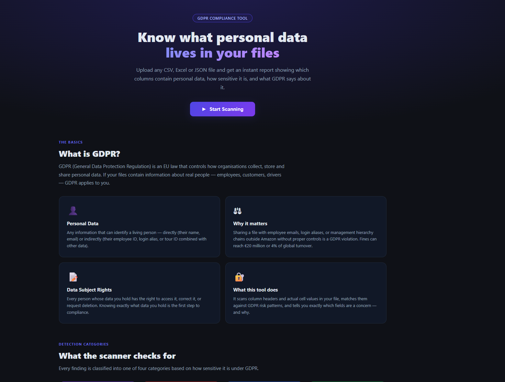
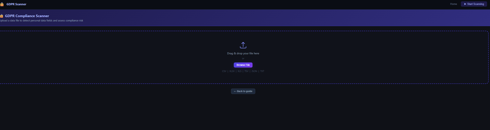
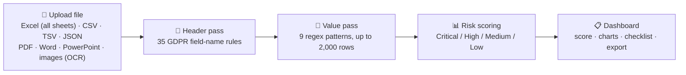

# GDPR Compliance Scanner

**Scan any data file for GDPR risk in under a minute.**
No signup. No server. No data ever leaves your browser.

## Preview

    
  

## The problem

Before a spreadsheet, export, or data dump gets shared, uploaded, or archived, someone has to ask: does this contain personal data GDPR cares about? Doing that by eye across hundreds of columns and thousands of rows is slow and easy to get wrong — a stray IBAN, DOB, or health note buried in row 4,000 is exactly what causes a real breach.

This tool scans the file itself, locally, and tells you in seconds what's in there and how risky it is.

## How it works

## How to use it

1. **Open the app** — click Start Scanning on the [live site](https://jeevan-0508.github.io/gdpr-compliance-scanner/gdpr_scanner.html), or open the downloaded file directly. No account, no install required.
2. **Drag and drop a file** (or click Browse):
   - **Tabular** — `.csv` `.tsv` `.xlsx` `.xls` `.xlsm` `.ods` `.json`. Every sheet in a workbook is scanned, not just the first.
   - **Documents** — `.pdf` `.docx` `.pptx` `.odt` `.xml` `.html` `.txt` `.md` `.log`
   - **Images (OCR)** — `.png` `.jpg` `.webp` `.bmp` `.tiff`
3. **Let it scan** — the header pass checks every column name against 35 GDPR field rules, then the value pass regex-scans up to 200 sampled rows per column for 9 pattern types (emails, IBANs, cards, national IDs, GPS, DOB, passport numbers, IP addresses). Free-text formats are scanned with 9 unanchored equivalents plus the field-name terms.

   Findings are grouped into six categories: **Art. 9 Special** (health, biometric, genetic, racial/ethnic, religious, political, sexual orientation), **Art. 10 Criminal** (allegations, offence type/MO, investigation and disciplinary case records), **Direct Identifier**, **Indirect Identifier**, **Value Pattern**, and **Retention** (Art. 5(1)(e) storage limitation — flags date columns whose newest record is 24+ months old).
4. **Read the dashboard** — GDPR Risk Score out of 100 with a grade, KPI cards, a donut chart by data type, and a sortable findings table with article references and remediation advice per field.
5. **Check the compliance checklist** — six pass/fail checks flag the specific gaps driving your score.
6. **Export the report** — one click downloads a standalone HTML report you can attach to an email, ticket, or audit file.
7. **(Optional) Install it as an app** — it's a PWA, so it can run offline once installed (see links below).

## Get the app

| 🌐 Live App | 💾 Download | 🖥️ Install (Desktop) | 📱 Install (Mobile) |
|:---:|:---:|:---:|:---:|
| [**OPEN IN BROWSER**](https://jeevan-0508.github.io/gdpr-compliance-scanner/gdpr_scanner.html) | [**DOWNLOAD gdpr_scanner.html**](https://github.com/Jeevan-0508/gdpr-compliance-scanner/raw/main/gdpr_scanner.html) | Chrome/Edge → install icon (⊕) in the address bar on the live site | Safari/Chrome → Share/Menu → **Add to Home Screen** |
| Runs instantly, always latest version | Single self-contained file — double-click to run fully offline, no server needed | Runs in its own window, works offline after first load | Full-screen app icon, works offline after first load |

## Features

| | |
|---|---|
| **Drag & drop upload** | 25 extensions — spreadsheets, PDF, Word, PowerPoint, markup, plain text, and images via OCR |
| **Multi-sheet workbooks** | Every sheet is scanned and reported separately, with a coverage banner naming what was read and what was skipped |
| **Two-pass detection** | Header-name analysis against 35 GDPR rules, plus value-level regex scanning of sampled rows (9 pattern types) |
| **Detects** | Emails, IBANs, credit cards, UK NI numbers, phone numbers, GPS coordinates, dates of birth, passport numbers, IP addresses, and Art. 9 special categories (health, race, religion, biometric, genetic, criminal conviction data) |
| **Risk scoring** | Critical / High / Medium / Low, mapped to GDPR articles, rolled up into a Risk Score /100 with a grade |
| **Dashboard** | KPI cards, donut chart by data type, sortable/filterable findings table with remediation advice |
| **Compliance checklist** | 6 automated pass/fail checks |
| **Exportable HTML report** | Generated entirely client-side, no server round-trip |
| **PWA** | Installable, works offline, network-first service worker so updates are never stuck behind a stale cache |
| **100% local** | All parsing and scanning happens in the browser — the file never leaves your machine |

## Tech stack

Single `gdpr_scanner.html`. SheetJS (Excel parsing) and Chart.js bundled inline for fully offline use — zero build step, zero external requests at runtime. `manifest.json` + `sw.js` for PWA install.

## GDPR Coverage

| Risk | Data Types |
|------|-----------|
| Critical | Health, racial/ethnic origin, religion, political opinion, sexual orientation, criminal conviction, biometric, genetic (Art. 9 & 10) |
| High | National ID, passport, email, phone, DOB, full name, address, IBAN, credit card, salary |
| Medium | IP address, GPS/location, device ID, cookie/session ID, demographic data, nationality, photos |
| Low | Record identifiers, timestamps, free text/notes |

## Privacy

All processing happens locally in the browser. No data is sent to any server — this is a static HTML file with no backend.

**Disclaimer:** For internal risk self-assessment only. Not legal advice.

## License

All rights reserved — see [LICENSE](LICENSE). No permission is granted to copy, modify, redistribute, or reuse this code without written permission from the author.

Built by **[Jeevan Kumar](https://github.com/Jeevan-0508)** — Amazon Transportation Risk & Fraud Operations, transitioning into AI Governance / AI Risk.

